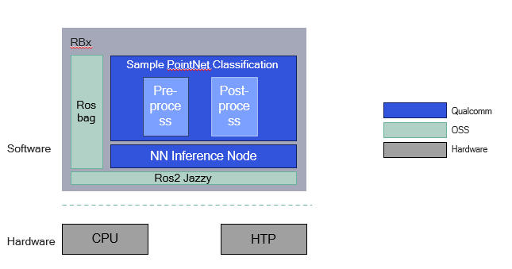

<div>
  <h1>AI Sample PointNet Classification</h1>
  <p align="center">
  </p>
</div>


---

## 👋 Overview

- This sample subscribes to a 3D point cloud on the `/livox/lidar` ROS topic (PointCloud2 format). It preprocesses the point cloud, uses QNN to perform model inference with a PointNet model, and publishes the classification result as a string on the `/pointnet_output` ROS topic.
- The model is based on [PointNet](https://arxiv.org/abs/1612.00593), a deep neural network that directly consumes point clouds for 3D object classification.

  

| Node Name | Function |
| --------- | -------- |
| ros2 bag play | Plays back a recorded MCAP bag file containing `/livox/lidar` PointCloud2 messages. |
| sample_pointnet_classification | Subscribes to PointCloud2 input for preprocessing, then performs postprocessing on the output tensor published by the qrb ros nn interface node. |
| [qrb ros nn interface](https://github.com/qualcomm-qrb-ros/qrb_ros_nn_inference) | Loads a trained AI model, receives preprocessed point cloud tensors, performs inference, and publishes results. |

## 🔎 Table of contents

- [👋 Overview](#-overview)
- [🔎 Table of contents](#-table-of-contents)
- [⚓ Used ROS Topics](#-used-ros-topics)
- [🎯 Supported targets](#-supported-targets)
- [✨ Installation](#-installation)
- [🚀 Usage](#-usage)
- [👨‍💻 Prerequisites](#-prerequisites)
- [👨‍💻 Build from source](#-build-from-source)
- [👨‍💻 Visualization](#-visualization)
- [🤝 Contributing](#-contributing)
- [❤️ Contributors](#️-contributors)
- [❔ FAQs](#-faqs)
- [📜 License](#-license)

## ⚓ Used ROS Topics

| ROS Topic | Type | Description |
| --------- | ---- | ----------- |
| `/livox/lidar` | `sensor_msgs/msg/PointCloud2` | Input 3D point cloud from Livox LiDAR or bag file |
| `/qrb_inference_input_tensor` | `qrb_ros_tensor_list_msgs/msg/TensorList` | Preprocessed point cloud tensor |
| `/qrb_inference_output_tensor` | `qrb_ros_tensor_list_msgs/msg/TensorList` | Neural network inference result |
| `/pointnet_output` | `std_msgs/msg/String` | Classification result string (e.g. `[3] desk`) |

## 🎯 Supported targets

<table>
  <tr>
    <th>Development Hardware</th>
    <th>Hardware Overview</th>
  </tr>
  <tr>
    <td>Qualcomm Dragonwing™ IQ-9075 EVK</td>
    <td>
      <a href="https://www.qualcomm.com/products/internet-of-things/industrial-processors/iq9-series/iq-9075">
        
      </a>
    </td>
  </tr>
  <tr>
    <td>Qualcomm Dragonwing™ IQ-8275 EVK</td>
    <td>
      <a href="https://www.qualcomm.com/internet-of-things/products/iq8-series/iq-8275">
        
      </a>
    </td>
  </tr>
</table>

## ✨ Installation

> [!IMPORTANT]
> The following steps need to be run on **Qualcomm Linux** and **ROS Jazzy**.<br>
> For Qualcomm Linux, please check out the [Qualcomm Intelligent Robotics Product SDK](https://docs.qualcomm.com/bundle/publicresource/topics/80-70018-265/introduction_1.html?vproduct=1601111740013072&version=1.4&facet=Qualcomm%20Intelligent%20Robotics%20Product%20(QIRP)%20SDK) documents.

## 🚀 Usage
<details>
  <summary>Build from source usage details</summary>

## 👨‍💻 Prerequisites

> [!NOTE]
> The following model preparation steps run on an **Ubuntu development machine** with QAIRT installed.

Add Qualcomm PPA repository source:
```bash
sudo add-apt-repository ppa:ubuntu-qcom-iot/qcom-ppa
sudo add-apt-repository ppa:ubuntu-qcom-iot/qirp
sudo apt update
```

Install QRB ROS packages:
```bash
sudo apt install -y ros-jazzy-qrb-ros-nn-inference
```

Download the PointNet TFLite model:
```bash
wget https://qaihub-public-assets.s3.us-west-2.amazonaws.com/qai-hub-models/models/pointnet/releases/v0.58.0/pointnet-tflite-float.zip
unzip pointnet-tflite-float.zip
```

Set up QAIRT environment following the [QAIRT general setup guide](https://docs.qualcomm.com/doc/80-63442-10/topic/general_setup.html).

Convert the TFLite model to QNN format:
```bash
qnn-tflite-converter \
    --input_network ./pointnet.tflite \
    --input_dim "image" 1,3,1024 \
    --output_path ./pointnet.cpp \
    --preserve_io datatype
```

Open a new terminal and install the cross-compilation toolchain:
```bash
sudo apt install g++-aarch64-linux-gnu
```

Generate the model runtime library:
```bash
qnn-model-lib-generator \
    -c ./pointnet.cpp \
    -b ./pointnet.bin \
    -o ./runtime/ \
    -t "aarch64-ubuntu-gcc9.4"
```

## 👨‍💻 Build from source

- Download source code from the qrb-ros-sample repository:
```bash
mkdir -p ~/qrb_ros_sample_ws/src && cd ~/qrb_ros_sample_ws/src
git clone -b jazzy-rel https://github.com/qualcomm-qrb-ros/qrb_ros_samples.git
```

- Build the sample from source code:
```bash
cd ~/qrb_ros_sample_ws/src/qrb_ros_samples/ai_vision/sample_pointnet_classification

rosdep install --from-paths . --ignore-src --rosdistro jazzy -y --skip-keys "qrb_ros_nn_inference"
source /opt/ros/jazzy/setup.bash
colcon build
source install/setup.bash
```

- Run the demo with the bundled chair point cloud sample:
```bash
ros2 launch sample_pointnet_classification launch_with_ros2_bag_play.py
```

- Run sample PointNet classification with your MCAP bag file:
```bash
ros2 launch sample_pointnet_classification launch_with_ros2_bag_play.py \
    mcap_path:=<path/to/your/bagfile.mcap>
```

- To specify a custom model path:
```bash
ros2 launch sample_pointnet_classification launch_with_ros2_bag_play.py \
    mcap_path:=<path/to/your/bagfile.mcap> \
    model_path:=<path/to/libpointnet.so>
```

</details>

## 👨‍💻 Visualization

- Check the classification result on the `/pointnet_output` topic in a new terminal:
```bash
source /opt/ros/jazzy/setup.bash
ros2 topic echo /pointnet_output
```

Expected output example: `data: '[3] desk'`

## 🤝 Contributing

We love community contributions! Get started by reading our [CONTRIBUTING.md](CONTRIBUTING.md).<br>
Feel free to create an issue for bug reports, feature requests, or any discussion 💡.

## ❤️ Contributors

Thanks to all our contributors who have helped make this project better!

<table>
  <tr>
    <td style="text-align: center;">
      <a href="https://github.com/kainli-QC">
        
        <br />
        <sub><b>kainli-QC</b></sub>
      </a>
    </td>
  </tr>
</table>

## ❔ FAQs

## 📜 License

Project is licensed under the [BSD-3-Clause](https://spdx.org/licenses/BSD-3-Clause.html) License. See [LICENSE](../../LICENSE) for the full license text.
